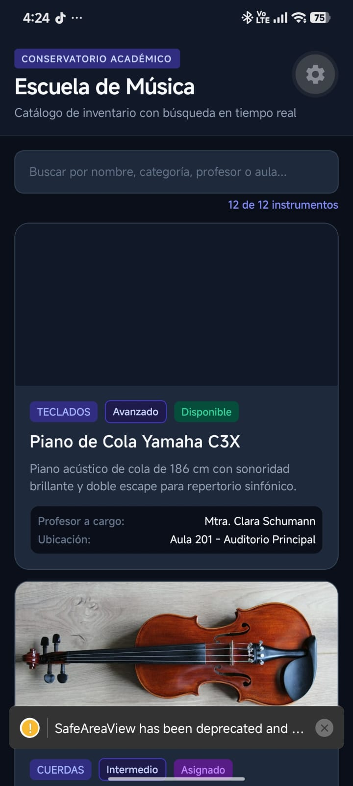
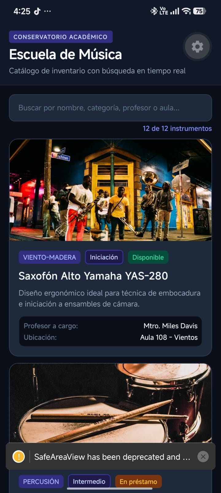
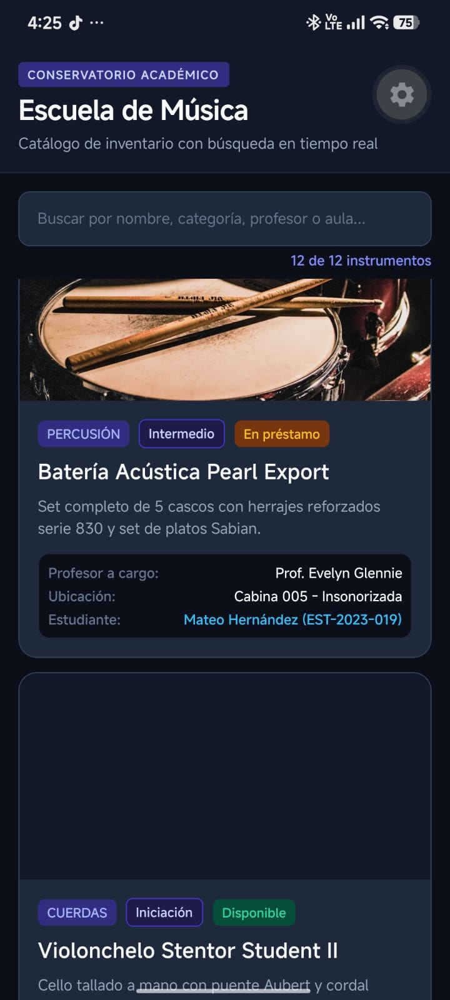
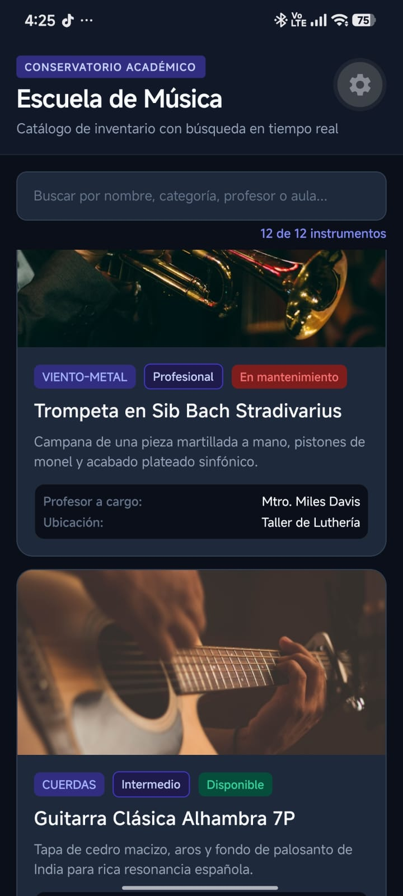
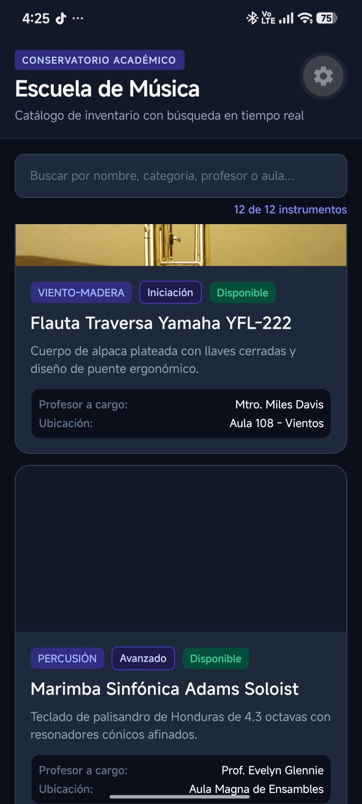
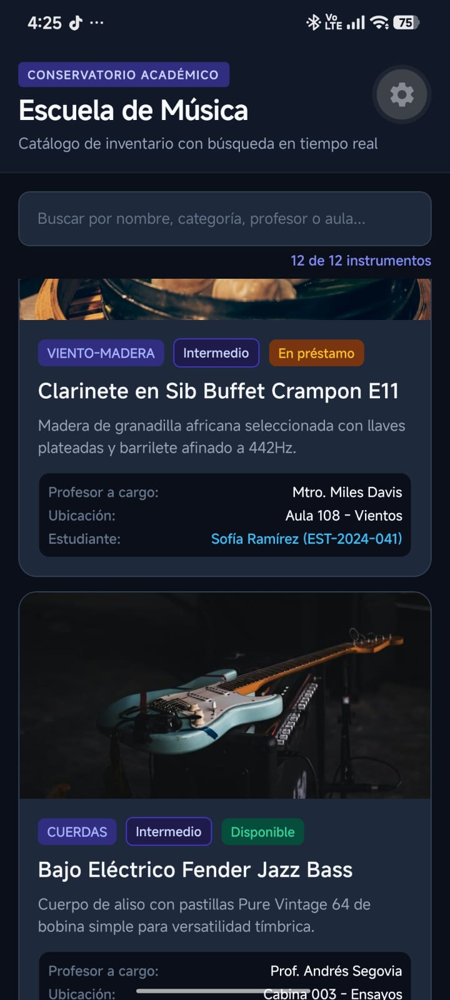
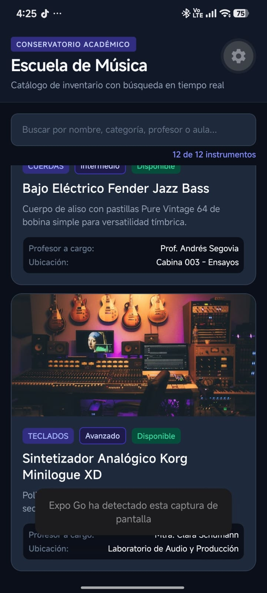

# Proyecto Semana 02 — App de Listas con Búsqueda (Escuela de Música)

## Descripción
En esta semana se construyó una aplicación móvil interactiva optimizada para el listado eficiente y filtrado en tiempo real de elementos del dominio asignado (**Escuela de Música**), utilizando `FlatList`, `TextInput`, `KeyboardAvoidingView` y los hooks de rendimiento de React (`useMemo` y `useCallback`).

Toda la aplicación implementa un sistema de diseño consistente basado en constantes de tema (`COLORS`, `TYPOGRAPHY`, `SPACING`, `RADIUS`, `SIZES`), eliminando valores arbitrarios o estilos inline.

El proyecto está desarrollado con **React Native**, **Expo SDK 57**, **TypeScript** y gestionado con **pnpm**.

---

## 📸 Capturas de la Aplicación en Expo Go (Android)

Las siguientes capturas documentan la aplicación corriendo en un dispositivo móvil real a través de **Expo Go**, mostrando el catálogo completo de 12 instrumentos, la barra de búsqueda en tiempo real, el diseño en modo oscuro y la jerarquía de las tarjetas:

| 1. Vista Inicial y Encabezado | 2. Cátedra de Vientos | 3. Percusión y Cuerdas |
| :---: | :---: | :---: |
|  |  |  |
| *Encabezado, buscador y primeros registros (Piano y Violín)* | *Saxofón Alto Yamaha con insignia de nivel y disponibilidad* | *Batería Pearl Export y Violonchelo Stentor Student* |

<br />

| 4. Metales y Luthería | 5. Ensambles Sinfónicos | 6. Préstamos Académicos |
| :---: | :---: | :---: |
|  |  |  |
| *Trompeta Bach Stradivarius en mantenimiento y Guitarra Alhambra* | *Flauta Traversa Yamaha y Marimba Sinfónica Adams* | *Clarinete Buffet Crampon en préstamo a estudiante* |

<br />

| 7. Cierre del Catálogo (12 de 12) |
| :---: |
|  |
| *Bajo Fender Jazz Bass y Sintetizador Analógico Korg Minilogue XD* |

---

## Dominio Asignado
- **Dominio:** Escuela de Música
- **Entidades modeladas en TypeScript (`src/types/index.ts`):** `Instrument`, `Teacher` y `Student`.
- **Datos de catálogo (`src/data/mockData.ts`):** 12 instrumentos reales con categorías (Cuerdas, Viento-Madera, Viento-Metal, Percusión, Teclados), niveles pedagógicos, estado de disponibilidad, imagen representativa en alta resolución, profesor responsable y estudiante asignado.

---

## Características y Requisitos Técnicos Implementados

1. **Búsqueda en Tiempo Real:**
   - Campo de entrada `TextInput` con soporte para búsqueda por:
     - Nombre del instrumento (ej. "Piano", "Violín", "Yamaha")
     - Categoría (ej. "Cuerdas", "Percusión", "Viento-Madera")
     - Nivel de dificultad (ej. "Iniciación", "Avanzado")
     - Profesor responsable (ej. "Clara Schumann", "Andrés Segovia")
     - Ubicación o aula (ej. "Aula 104", "Cabina 005")

2. **Optimización con Hooks de React:**
   - `useMemo`: Memoriza la colección de instrumentos filtrados, recalculándola únicamente cuando cambia `searchQuery`.
   - `useCallback`: Memoriza la función `renderItem`, el separador de tarjetas (`ItemSeparatorComponent`), el componente de estado vacío (`ListEmptyComponent`) y el extractor de claves (`keyExtractor`).

3. **Listado de Alto Rendimiento (`FlatList`):**
   - `keyExtractor` basado estrictamente en el `id` único del item (`(item: Instrument) => item.id`), **sin utilizar el índice del arreglo**.
   - `ItemSeparatorComponent` para mantener un espaciado visual consistente y limpio entre tarjetas.
   - `ListEmptyComponent` con ícono y mensaje amigable cuando no existen coincidencias para el término buscado.
   - `keyboardShouldPersistTaps="handled"` para permitir interacción fluida durante la escritura.

4. **Gestión de Teclado:**
   - Envoltorio con `KeyboardAvoidingView` configurado con `behavior={Platform.OS === 'ios' ? 'padding' : undefined}` para evitar que el teclado oculte la lista o el campo de búsqueda.

5. **Componente de Tarjeta Modular (`ItemCard`):**
   - Muestra imagen nativa con `Image` de React Native.
   - Etiquetas visuales diferenciadas para Categoría, Nivel y Estado (`Disponible`, `En préstamo`, `Asignado`, `En mantenimiento`).
   - Panel de metadatos estructurados con Profesor a cargo, Ubicación y Estudiante asignado.
   - Optimizado con `React.memo`.

6. **Theming Centralizado (`src/theme/index.ts`):**
   - Todos los estilos en `StyleSheet.create` consumen tokens del tema (`COLORS`, `SPACING`, `TYPOGRAPHY`, `RADIUS`, `SIZES`). Cero estilos inline en JSX.

7. **TypeScript Estricto:**
   - 100% libre de `any`, validado con `pnpm exec tsc --noEmit`.

---

## 📂 Estructura del Proyecto

```text
├── images/                    # Capturas de pantalla de la app en ejecución en Expo Go
│   ├── paginaweb1.jpeg
│   ├── paginaweb2.jpeg
│   ├── paginaweb3.jpeg
│   ├── paginaweb4.jpeg
│   ├── paginaweb5.jpeg
│   ├── paginaweb6.jpeg
│   └── paginaweb7.jpeg
│
├── src/
│   ├── components/
│   │   └── ItemCard.tsx       # Tarjeta modular con Image y metadatos estructurados
│   ├── data/
│   │   └── mockData.ts        # 12 instrumentos musicales tipados con profesores y alumnos
│   ├── screens/
│   │   └── HomeScreen.tsx     # Pantalla principal con FlatList, TextInput, useMemo y useCallback
│   ├── theme/
│   │   └── index.ts           # Constantes de tema (COLORS, SPACING, TYPOGRAPHY, RADIUS, SIZES)
│   └── types/
│       └── index.ts           # Interfaces TypeScript (Instrument, Teacher, Student)
│
├── .npmrc                     # Configuración de pnpm (node-linker=hoisted)
├── app.json                   # Configuración de Expo ("Escuela de Música")
├── App.tsx                    # Punto de entrada con StatusBar
├── index.ts                   # Registro de raíz de Expo
├── package.json               # Dependencias del proyecto (Expo SDK 57)
├── README.md                  # Documentación técnica
└── tsconfig.json              # Configuración estricta de TypeScript
```

---

## ⚙️ Cómo Ejecutar el Proyecto con pnpm

1. **Instalar dependencias:**
   ```bash
   pnpm install
   ```

2. **Iniciar en la Web:**
   ```bash
   pnpm web
   ```

3. **Iniciar el servidor de desarrollo de Expo para móvil (Expo Go):**
   ```bash
   pnpm start
   # o con túnel:
   pnpm start --tunnel
   ```

4. **Validar tipos con TypeScript:**
   ```bash
   pnpm exec tsc --noEmit
   ```
