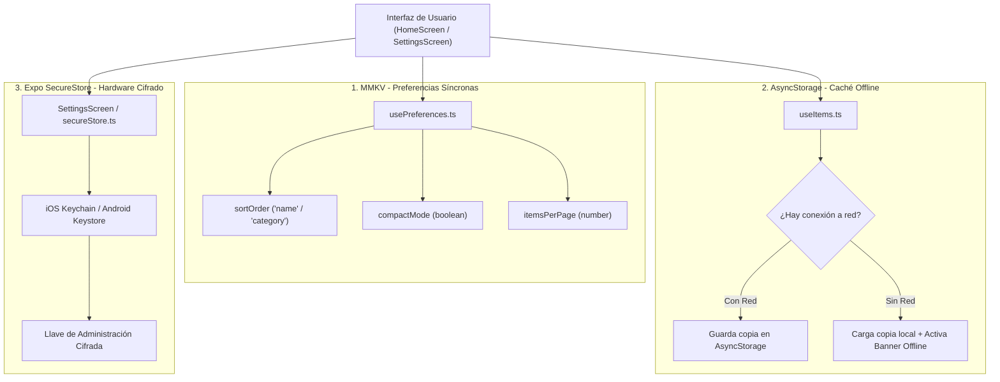
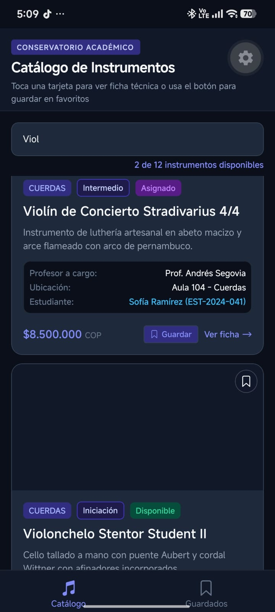
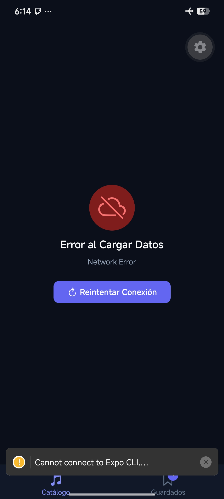
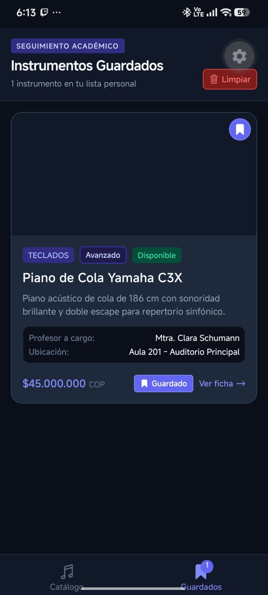
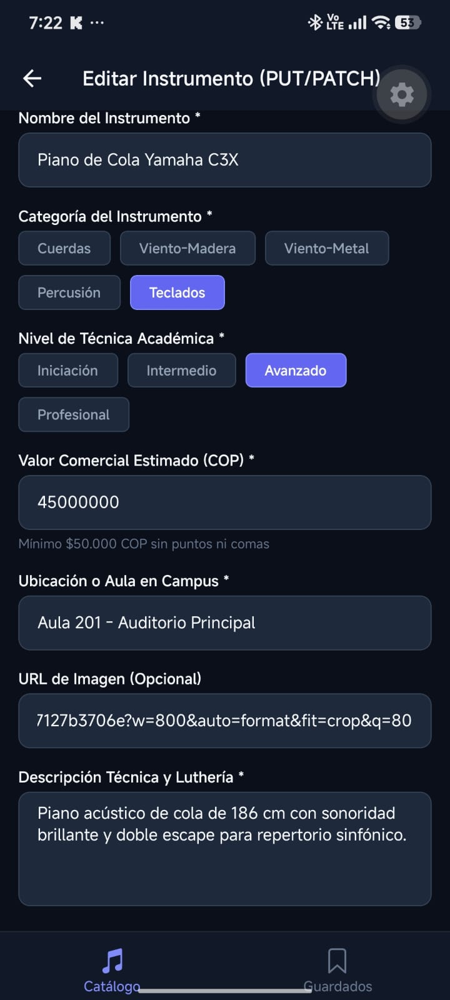
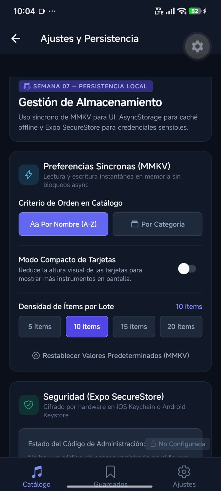
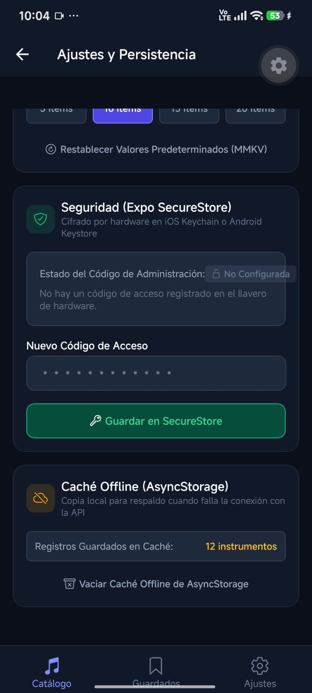

# Proyecto Semana 07 — Persistencia Local (Escuela de Música)

Proyecto móvil desarrollado en **React Native**, **Expo SDK 57**, **React Navigation 7**, **TypeScript**, **MMKV**, **AsyncStorage**, **Expo SecureStore**, **Axios**, **TanStack Query v5**, **React Hook Form** y **Zod**, correspondiente a la **Semana 07 — Persistencia Local**, enfocado en la implementación de una arquitectura de persistencia multicapa para la **Escuela de Música / Conservatorio Académico**.

---

## 🎯 Arquitectura de Persistencia Local Multicapa

La aplicación implementa tres tecnologías nativas de almacenamiento, cada una seleccionada estratégicamente según su caso de uso óptimo:



### 1. MMKV (`react-native-mmkv`): Preferencias Síncronas de UI
- **Instancia Global:** Centralizada en `src/storage/mmkv.ts` con fallback seguro para web.
- **Hook Reactivo `usePreferences.ts`:**
  - `sortOrder`: Orden dinámico del catálogo (`'name'` o `'category'`).
  - `compactMode`: Densidad visual de las tarjetas de instrumentos (reduce la altura para visualizar más ítems).
  - `itemsPerPage`: Cantidad de registros por lote.
- **Ventaja Técnica:** Acceso instantáneo en memoria compartida (memory-mapped) sin necesidad de `async/await` ni spinners de carga en la UI.

### 2. AsyncStorage (`@react-native-async-storage/async-storage`): Caché Offline
- **Estrategia Offline-First en `src/hooks/useItems.ts`:**
  - Tras cada petición exitosa a la API con Axios, se guarda una copia fresca de los instrumentos en AsyncStorage (`@music_school_items_offline_cache`).
  - Ante fallas de conexión o pérdida de red, captura el error y carga automáticamente los instrumentos desde la caché local.
  - Expone el estado `isOffline: boolean` para activar el banner en `HomeScreen`:
    > **⚠️ Mostrando datos sin red** — Copia local recuperada automáticamente desde AsyncStorage.

### 3. Expo SecureStore (`expo-secure-store`): Seguridad Cifrada por Hardware
- **Información Sensible Protegida:** Código de acceso y llave de administración de la escuela (`ADMIN_PASSKEY`).
- **Enmascaramiento Estricto:** La clave se almacena en el llavero seguro del sistema operativo (Keychain en iOS / Keystore en Android) y **NUNCA** se muestra en texto plano en la interfaz (se visualiza únicamente como confirmación enmascarada `••••••••`).
- **Operaciones:** Guardar, verificar estado cifrado y revocar/eliminar llave.

### 4. Pantalla de Ajustes (`src/screens/SettingsScreen.tsx`)
- Panel interactivo centralizado que permite:
  - Cambiar el orden del catálogo y alternar el modo compacto en tiempo real.
  - Gestionar el código de administración en SecureStore.
  - Inspeccionar el tamaño y vaciar la caché offline de AsyncStorage.

---

## 📸 Evidencias de la Aplicación en Expo Go (Android)

Las siguientes capturas documentan la aplicación corriendo en un dispositivo móvil real a través de **Expo Go**:

| 1. Catálogo y Navegación | 2. Botón Guardar en Tarjetas | 3. Búsqueda y Filtrado en Vivo |
| :---: | :---: | :---: |
|  |  |  |
| *HomeScreen con pestañas de navegación ("Catálogo" y "Guardados")* | *Tarjeta de instrumento con botón interactivo "Guardar" conectado al store* | *Filtrado en tiempo real con término de búsqueda "Viol" y contador dinámico* |

<br />

| 4. Manejo de Error de Red (Network Error) | 5. Guardados con Badge en Tiempo Real | 6. Edición PUT/PATCH con Hook Form + Zod |
| :---: | :---: | :---: |
|  |  |  |
| *Estado de error con botón "Reintentar Conexión" al fallar la petición HTTP* | *Tab de Guardados con botón "Limpiar" y badge numérico "1" sincronizado en vivo con Zustand* | *Pantalla EditScreen con datos precargados vía reset(), chips de categoría/nivel y validación Zod* |

<br />

| 7. Preferencias Síncronas (MMKV) | 8. Llavero Seguro (SecureStore) y Caché Offline |
| :---: | :---: |
|  |  |
| *Pantalla de Ajustes con selectores y switches reactivos síncronos (orden, modo compacto, ítems por lote)* | *Gestión de clave de administración cifrada en hardware (SecureStore) y estado de la caché offline en AsyncStorage (12 instrumentos)* |

---

## 🔒 Tipado Estricto con Zod e Inferencia TypeScript

```typescript
// src/schemas/itemSchema.ts
export const itemSchema = z.object({
  name: z.string().min(3, 'El nombre debe contener al menos 3 caracteres'),
  category: z.enum(CATEGORIES),
  level: z.enum(LEVELS),
  priceCOP: z
    .number()
    .positive('El valor comercial debe ser mayor a 0 COP')
    .min(50000, 'El valor mínimo registrado es $50.000 COP'),
  roomLocation: z.string().min(3, 'Ubicación en campus obligatoria'),
  description: z.string().min(10, 'Descripción técnica obligatoria (mínimo 10 caracteres)'),
  imageUrl: z.string().url().optional().or(z.literal('')),
});

export type ItemFormData = z.infer<typeof itemSchema>;
```

---

## 📂 Estructura del Proyecto

```text
├── images/                          # Evidencias fotográficas en Expo Go
├── src/
│   ├── components/
│   │   ├── FormField.tsx            # Componente reutilizable con Controller, TextInput y errores
│   │   └── ItemCard.tsx             # Tarjeta interactiva con soporte para compactMode (MMKV)
│   ├── data/
│   │   └── mockData.ts              # Catálogo base de instrumentos, profesores y alumnos
│   ├── hooks/
│   │   ├── useItems.ts              # TanStack Query + caché offline con AsyncStorage
│   │   ├── usePreferences.ts        # Hook reactivo síncrono con MMKV (sortOrder, compactMode)
│   │   └── useCreateItem.ts         # Hook compatible de mutación con invalidación de caché
│   ├── navigation/
│   │   ├── RootNavigator.tsx        # Stack (Home, Detail, Create, Edit, Settings) + Tabs (Catálogo, Guardados, Ajustes)
│   │   ├── AppNavigator.tsx         # Exportador compatible de RootNavigator
│   │   └── types.ts                 # Tipos fuertemente tipados de navegación
│   ├── schemas/
│   │   └── itemSchema.ts            # Esquema Zod + inferencia ItemFormData
│   ├── screens/
│   │   ├── HomeScreen.tsx           # Catálogo con sortOrder, compactMode y banner offline
│   │   ├── DetailScreen.tsx         # Ficha técnica con acceso directo a edición
│   │   ├── CreateScreen.tsx         # Formulario de alta con React Hook Form + Zod
│   │   ├── EditScreen.tsx           # Formulario de edición con defaultValues y reset()
│   │   ├── SavedScreen.tsx          # Tab de favoritos sincronizado con Zustand
│   │   └── SettingsScreen.tsx       # Panel de preferencias MMKV, SecureStore y AsyncStorage
│   ├── services/
│   │   └── api.ts                   # Instancia centralizada de Axios con endpoints GET, POST y PATCH
│   ├── storage/
│   │   ├── mmkv.ts                  # Instancia global de MMKV con fallback de memoria
│   │   └── secureStore.ts           # Wrapper seguro de Expo SecureStore con enmascaramiento
│   ├── stores/
│   │   └── savedStore.ts            # Store global de Zustand
│   ├── theme/
│   │   └── index.ts                 # Constantes de diseño (COLORS, SPACING, TYPOGRAPHY, RADIUS, SIZES)
│   └── types/
│       └── index.ts                 # Interfaces: Instrument, Item, CreateItemPayload, UpdateItemPayload
├── .npmrc                           # Configuración pnpm (node-linker=hoisted)
├── app.json                         # Configuración de Expo (plugin expo-secure-store)
├── App.tsx                          # QueryClientProvider + SafeAreaProvider + RootNavigator
├── index.ts                         # Entrypoint de Expo
├── package.json                     # Dependencias (Expo SDK 57, React Hook Form, Zod, TanStack Query)
├── README.md                        # Documentación técnica
└── tsconfig.json                    # Configuración estricta de TypeScript
```

---

## ⚙️ Cómo Ejecutar el Proyecto con pnpm

1. **Instalar dependencias:**
   ```bash
   pnpm install
   ```

2. **Iniciar el servidor de desarrollo de Expo para móvil (Expo Go):**
   ```bash
   pnpm start
   ```

3. **Iniciar en web:**
   ```bash
   pnpm web
   ```

4. **Validación estricta de TypeScript:**
   ```bash
   pnpm exec tsc --noEmit
   ```
