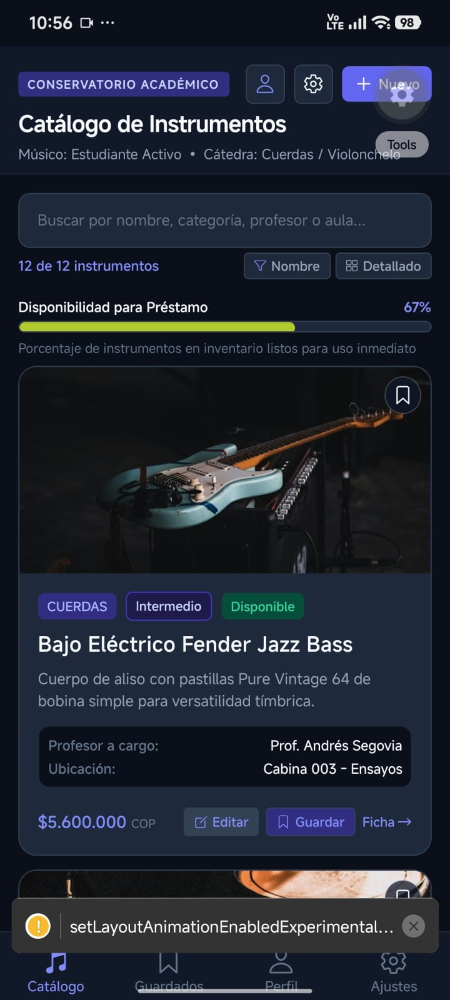
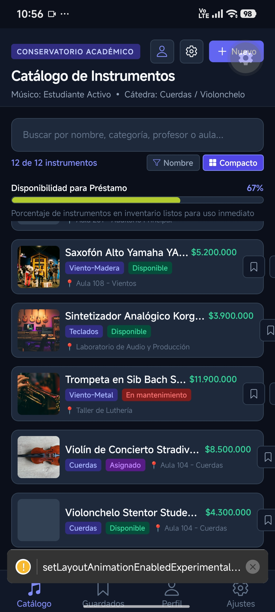
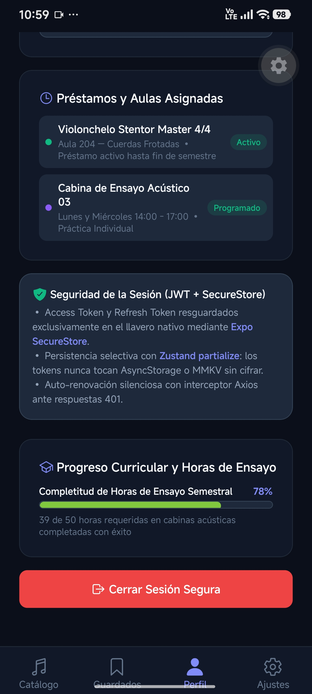

# Proyecto Semana 09 — Animaciones Básicas (Escuela de Música)

Proyecto móvil desarrollado en **React Native**, **Expo SDK 57**, **React Navigation 7**, **TypeScript**, **Animated API**, **LayoutAnimation**, **Zustand**, **Expo SecureStore**, **Axios**, **TanStack Query v5**, **React Hook Form** y **Zod**, correspondiente a la **Semana 09 — Animaciones Básicas**, enfocado en la implementación de una experiencia de usuario interactiva y fluida mediante animaciones a 60 FPS adaptadas a la **Escuela de Música / Conservatorio Académico**.

---

## 🎯 Arquitectura de Animaciones y Experiencia Táctil

```mermaid
flowchart TD
    subgraph NativeDriver ["1. Animated API (useNativeDriver: true - 60 FPS)"]
        Parallel["Animated.parallel (DetailScreen)"]
        Fade["Fade In: Opacity 0 -> 1"]
        Slide["Slide Up: TranslateY 30 -> 0"]
        Parallel --> Fade
        Parallel --> Slide
        
        Spring["Animated.spring (AnimatedCard & AnimatedButton)"]
        PressIn["onPressIn: scale 1.0 -> 0.95"]
        PressOut["onPressOut: scale 0.95 -> 1.0"]
        Spring --> PressIn
        Spring --> PressOut
        
        Stagger["Animated.stagger (HomeScreen)"]
        Cascade["Cascade Entry: 80ms delay entre ítems"]
        Stagger --> Cascade
    end

    subgraph JSAnimations ["2. Animated API (useNativeDriver: false)"]
        Progress["ProgressBar.tsx"]
        WidthInt["interpolate: Width '0%' -> '100%'"]
        ColorInt["interpolate: '#ef4444' -> '#facc15' -> '#22c55e'"]
        Progress --> WidthInt
        Progress --> ColorInt
    end

    subgraph LayoutGroup ["3. LayoutAnimation (Transiciones Globales)"]
        Layout["LayoutAnimation.configureNext(easeInEaseOut)"]
        ToggleSave["Guardar / Eliminar Favoritos"]
        FilterSearch["Búsqueda y Modo Compacto"]
        AndroidUI["UIManager.setLayoutAnimationEnabledExperimental(true)"]
        Layout --> ToggleSave
        Layout --> FilterSearch
        AndroidUI --> Layout
    end

    subgraph Views ["4. Pantallas y Componentes"]
        HomeView["HomeScreen (Catálogo en Cascada)"]
        DetailView["DetailScreen (Entrada Suave y Ficha Técnica)"]
        ProfileView["ProfileScreen (Progreso Curricular y Logout)"]
    end

    Cascade --> HomeView
    Spring --> HomeView
    Layout --> HomeView
    Parallel --> DetailView
    Progress --> DetailView
    Progress --> HomeView
    Progress --> ProfileView
```



---

## 🔑 Pilares Técnicos de la Semana 09 (Animaciones)

### 1. Animación de Entrada en Cascada (`HomeScreen.tsx`): `Animated.stagger(80, [...])`
- **Efecto de Cascada Escalonada:** Al cargar el catálogo o actualizar los filtros, los ítems de la lista principal no aparecen de golpe, sino mediante una secuencia suave con retardo de 80ms entre cada tarjeta.
- **Transformaciones Combinadas:** Cada tarjeta interpola simultáneamente su opacidad (`0 → 1`) y un desplazamiento vertical `translateY` (`24 → 0`), logrando una llegada progresiva a 60 FPS con `useNativeDriver: true`.

```typescript
// HomeScreen.tsx
const animations = processedInstruments.map((_, i) =>
  Animated.timing(animValues[i], {
    toValue: 1,
    duration: 350,
    useNativeDriver: true,
  })
);
Animated.stagger(80, animations).start();
```

### 2. Feedback Táctil Elástico (`AnimatedCard.tsx`): `Animated.spring`
- **Respuesta Natural al Tacto:** Cada tarjeta del catálogo de instrumentos se "comprime" orgánicamente al interactuar con ella mediante física de resortes (`friction: 7`, `tension: 120`):
  - `onPressIn`: `scale: 1.0 → 0.95`
  - `onPressOut`: `scale: 0.95 → 1.0` (efecto rebote suave)
- **Rendimiento:** Ejecutado enteramente en el hilo nativo de la GPU mediante `useNativeDriver: true`, evitando saltos de frames durante el scroll.

### 3. Animación de Entrada Suave en `DetailScreen.tsx`: `Animated.parallel`
- **Entrada Paralela:** Al abrir la ficha técnica del instrumento, el contenido se desliza elegantemente a la vista:
  - `fade in`: `opacity: 0 → 1`
  - `slide up`: `translateY: 30 → 0`
  - Duración coordinada: 500ms
  - `useNativeDriver: true`

```typescript
// DetailScreen.tsx
Animated.parallel([
  Animated.timing(fadeAnim, {
    toValue: 1,
    duration: 500,
    useNativeDriver: true,
  }),
  Animated.timing(slideAnim, {
    toValue: 0,
    duration: 500,
    useNativeDriver: true,
  }),
]).start();
```

### 4. Barra de Progreso con Interpolación Dinámica (`ProgressBar.tsx`)
- **Doble Interpolación Coordinada:**
  - **Ancho:** `0% → 100%` según el avance curricular o inventario disponible.
  - **Color Semántico Continuo:** De rojo (`#ef4444`) a amarillo (`#facc15`) y finalmente verde (`#22c55e`).
- **Aplicación en el Dominio Musical:**
  - En `HomeScreen`: Monitoreo en vivo de la disponibilidad del catálogo para préstamo inmediato.
  - En `DetailScreen`: Nivel de dominio técnico y avance en el repertorio sinfónico asignado.
  - En `ProfileScreen`: Completitud de horas semestrales de práctica en cabinas acústicas.

### 5. Transiciones Suaves con `LayoutAnimation`
- **Animación Automática de Interfaz:** Al guardar o quitar un instrumento de favoritos, alternar entre modo compacto y detallado, o filtrar por búsqueda, la reubicación de elementos en el layout se anima fluidamente usando `LayoutAnimation.configureNext(LayoutAnimation.Presets.easeInEaseOut)`.
- **Soporte Android:** Configuración experimental asegurada fuera del ciclo de vida del componente:
  ```typescript
  if (Platform.OS === 'android' && UIManager.setLayoutAnimationEnabledExperimental) {
    UIManager.setLayoutAnimationEnabledExperimental(true);
  }
  ```

### 6. Micro-Animaciones de Botones (`AnimatedButton.tsx`)
- Botón táctil reutilizable con compresión `scale: 0.96` en `onPressIn` y rebote natural a `1.0` en `onPressOut`.
- Utilizado en las solicitudes de reserva de instrumentos y el botón de cierre de sesión seguro.

---

## 🔐 Módulos de Autenticación y Persistencia (Semanas 07 y 08)

- **Autenticación JWT:** Login y Registro validados con **Zod** y **React Hook Form**.
- **Tokens Cifrados:** `accessToken` y `refreshToken` almacenados **exclusivamente** en el llavero de hardware con **Expo SecureStore** (`tokenService.ts`).
- **Persistencia Selectiva Zustand:** `persist` con `partialize` para aislar los tokens de `AsyncStorage`.
- **Interceptor Axios:** Renovación automática de sesión ante errores `401 Unauthorized` con reintento transparente de petición.
- **Navegación Condicional:** `RootNavigator` cambia dinámicamente entre `AuthNavigator` y `AppNavigator` según `isAuthenticated`.

---

## 📸 Evidencias de la Aplicación en Expo Go (Android)

### 🎬 1. Animaciones Básicas, Barras de Progreso e Interacciones (Semana 09)

Las siguientes capturas documentan las animaciones nativas a 60 FPS, las barras de progreso con interpolación de ancho/color y las transiciones con `LayoutAnimation`:

| 1. Barra de Disponibilidad (HomeScreen) | 2. Transición a Modo Compacto (LayoutAnimation) | 3. Progreso Curricular y Botón Táctil (ProfileScreen) |
| :---: | :---: | :---: |
|  |  |  |
| *HomeScreen con barra animada de "Disponibilidad para Préstamo" al 67%, catálogo en cascada y tarjetas interactivas* | *Transición instantánea y fluida entre vista detallada y compacta mediante LayoutAnimation.configureNext()* | *ProfileScreen con barra de progreso curricular al 78% e interacción táctil elástica en el botón "Cerrar Sesión Segura"* |

<br />

### 🔐 2. Flujo de Autenticación, Sesión Segura y Perfil (Semana 08)

Las siguientes capturas documentan las pantallas y el flujo de autenticación JWT implementado en la aplicación:

| 4. Formulario de Login | 5. Verificación SecureStore |
| :---: | :---: |
|  |  |
| *Pantalla de acceso con validación Zod, React Hook Form y chips de prueba rápida* | *Splash de carga reactivo validando tokens en el llavero cifrado de Expo SecureStore* |

<br />

| 6. Perfil del Músico Autenticado | 7. Llavero Seguro y Cierre de Sesión |
| :---: | :---: |
|  |  |
| *Perfil del estudiante con matrícula oficial, cátedra instrumental y préstamos activos* | *Tarjeta técnica de seguridad JWT + SecureStore y botón para cerrar sesión* |

<br />

### 📦 3. Catálogo, Persistencia Local y Caché Offline (Semanas Anteriores)

| 8. Catálogo y Navegación | 9. Botón Guardar en Tarjetas | 10. Búsqueda y Filtrado en Vivo |
| :---: | :---: | :---: |
|  |  |  |
| *HomeScreen con pestañas de navegación ("Catálogo" y "Guardados")* | *Tarjeta de instrumento con botón interactivo "Guardar" conectado al store* | *Filtrado en tiempo real con término de búsqueda "Viol" y contador dinámico* |

<br />

| 11. Manejo de Error de Red (Network Error) | 12. Guardados con Badge en Tiempo Real | 13. Edición PUT/PATCH con Hook Form + Zod |
| :---: | :---: | :---: |
|  |  |  |
| *Estado de error con botón "Reintentar Conexión" al fallar la petición HTTP* | *Tab de Guardados con botón "Limpiar" y badge numérico "1" sincronizado en vivo con Zustand* | *Pantalla EditScreen con datos precargados vía reset(), chips de categoría/nivel y validación Zod* |

<br />

| 14. Preferencias Síncronas (MMKV) | 15. Llavero Seguro (SecureStore) y Caché Offline |
| :---: | :---: |
|  |  |
| *Pantalla de Ajustes con selectores y switches reactivos síncronos (orden, modo compacto, ítems por lote)* | *Gestión de clave de administración cifrada en hardware (SecureStore) y estado de la caché offline en AsyncStorage (12 instrumentos)* |

---

## 🔒 Tipado Estricto de Autenticación con Zod e Inferencia TypeScript

```typescript
// src/schemas/authSchema.ts
import { z } from 'zod';
import { CATEGORIES, LEVELS } from './itemSchema';

export const loginSchema = z.object({
  username: z
    .string()
    .min(3, 'El nombre de usuario debe contener al menos 3 caracteres')
    .max(50, 'El nombre de usuario no puede exceder 50 caracteres'),
  password: z
    .string()
    .min(4, 'La contraseña debe contener al menos 4 caracteres'),
});

export type LoginFormData = z.infer<typeof loginSchema>;

export const registerSchema = z.object({
  fullName: z
    .string()
    .min(3, 'El nombre completo debe contener al menos 3 caracteres')
    .max(80, 'El nombre no puede exceder 80 caracteres'),
  username: z
    .string()
    .min(3, 'El nombre de usuario debe contener al menos 3 caracteres')
    .max(30, 'El nombre de usuario no puede superar 30 caracteres')
    .regex(/^[a-zA-Z0-9_]+$/, 'Solo se permiten letras, números y guiones bajos'),
  email: z
    .string()
    .email('Debe ingresar un correo electrónico institucional o personal válido'),
  password: z
    .string()
    .min(6, 'La contraseña debe tener al menos 6 caracteres'),
  instrumentInterest: z.enum(CATEGORIES),
  academicLevel: z.enum(LEVELS),
});

export type RegisterFormData = z.infer<typeof registerSchema>;
```

---

## 📂 Estructura del Proyecto

```text
├── images/                          # Evidencias fotográficas en Expo Go (15 capturas)
├── src/
│   ├── components/
│   │   ├── AnimatedCard.tsx         # Tarjeta con compresión spring scale (1 -> 0.95 -> 1)
│   │   ├── AnimatedButton.tsx       # Botón con micro-animaciones táctiles elásticas
│   │   ├── ProgressBar.tsx          # Barra de progreso con interpolate (ancho y transición de color)
│   │   ├── FormField.tsx            # Componente reutilizable con Controller, TextInput y errores
│   │   └── ItemCard.tsx             # Tarjeta interactiva con soporte para compactMode
│   ├── data/
│   │   └── mockData.ts              # Catálogo base de instrumentos, profesores y alumnos
│   ├── hooks/
│   │   ├── useItems.ts              # TanStack Query + caché offline con AsyncStorage
│   │   ├── usePreferences.ts        # Hook reactivo síncrono con MMKV (sortOrder, compactMode)
│   │   └── useCreateItem.ts         # Hook de mutación con invalidación de caché
│   ├── navigation/
│   │   ├── RootNavigator.tsx        # Navegación condicional (AuthNavigator vs AppNavigator)
│   │   ├── AuthNavigator.tsx        # Stack no autenticado (Login y Registro)
│   │   ├── AppNavigator.tsx         # Stack autenticado (HomeTab, SavedTab, ProfileTab, SettingsTab)
│   │   └── types.ts                 # Tipos fuertemente tipados de navegación (cero any)
│   ├── schemas/
│   │   ├── authSchema.ts            # Esquemas Zod para login y registro (LoginFormData, RegisterFormData)
│   │   └── itemSchema.ts            # Esquema Zod para instrumentos (ItemFormData)
│   ├── screens/
│   │   ├── HomeScreen.tsx           # Catálogo con entrada en cascada (stagger), AnimatedCard y LayoutAnimation
│   │   ├── DetailScreen.tsx         # Ficha técnica con animación parallel (fade in + slide up) y ProgressBar
│   │   ├── ProfileScreen.tsx        # Perfil del usuario, ProgressBar de práctica y AnimatedButton de logout
│   │   ├── LoginScreen.tsx          # Formulario de acceso con Zod + Hook Form y chips de prueba
│   │   ├── RegisterScreen.tsx       # Formulario de registro con selectores de cátedra y nivel
│   │   ├── CreateScreen.tsx         # Formulario de alta de instrumentos (POST)
│   │   ├── EditScreen.tsx           # Formulario de edición de instrumentos (PUT/PATCH)
│   │   ├── SavedScreen.tsx          # Tab de favoritos sincronizado con Zustand
│   │   └── SettingsScreen.tsx       # Panel de preferencias MMKV, SecureStore y AsyncStorage
│   ├── services/
│   │   ├── api.ts                   # Instancia Axios con interceptores Bearer y auto-refresh 401
│   │   ├── authService.ts           # Servicios de API auth (loginApi, refreshTokensApi, getMeApi, registerApi)
│   │   └── tokenService.ts          # Wrapper de Expo SecureStore para tokens JWT seguros
│   ├── storage/
│   │   ├── mmkv.ts                  # Instancia global de MMKV con fallback síncrono
│   │   └── secureStore.ts           # Wrapper seguro de Expo SecureStore con enmascaramiento
│   ├── stores/
│   │   ├── authStore.ts             # Store global de autenticación con Zustand (persist + partialize)
│   │   └── savedStore.ts            # Store global de instrumentos guardados
│   ├── theme/
│   │   └── index.ts                 # Design System (COLORS, SPACING, TYPOGRAPHY, RADIUS, SIZES)
│   └── types/
│       └── index.ts                 # Tipos de dominio: Instrument, User, AuthTokens, LoginResponse, etc.
├── .npmrc                           # Configuración pnpm (node-linker=hoisted)
├── app.json                         # Configuración de Expo (plugin expo-secure-store)
├── App.tsx                          # QueryClientProvider + SafeAreaProvider + RootNavigator
├── index.ts                         # Entrypoint de Expo
├── package.json                     # Dependencias (Expo SDK 57, React Hook Form, Zod, Zustand, Axios)
├── README.md                        # Documentación técnica
└── tsconfig.json                    # Configuración estricta de TypeScript
```

---

## ⚙️ Cómo Ejecutar el Proyecto con pnpm

1. **Instalar dependencias:**
   ```bash
   pnpm install
   ```

2. **Iniciar el servidor de desarrollo de Expo para móvil (Expo Go):**
   ```bash
   pnpm start
   ```

3. **Iniciar en web:**
   ```bash
   pnpm web
   ```

4. **Validación estricta de TypeScript (0 errores, 0 `any`):**
   ```bash
   pnpm exec tsc --noEmit
   ```
