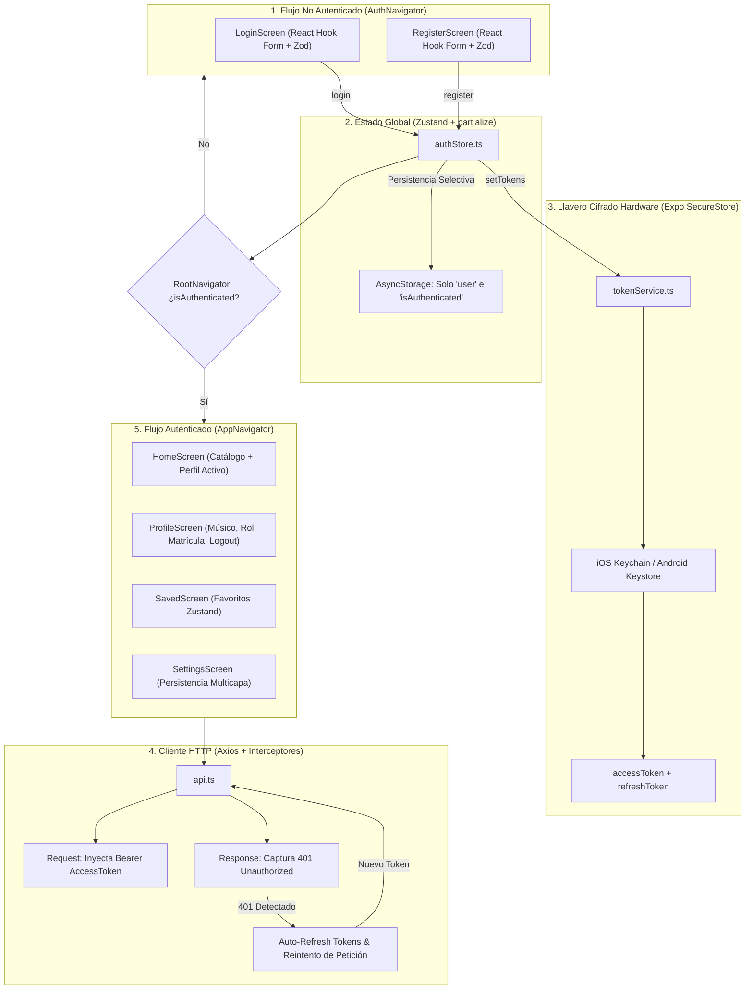
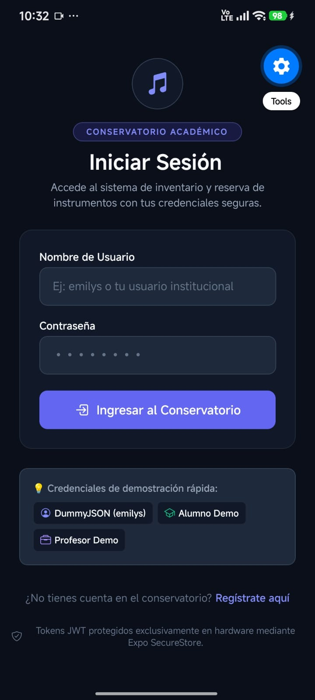
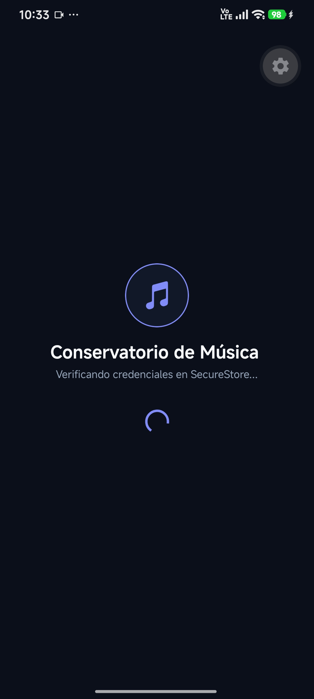
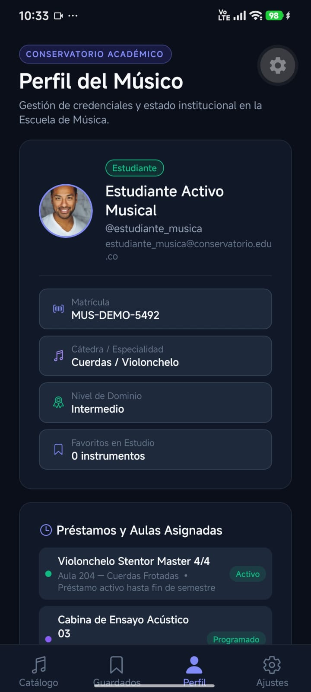
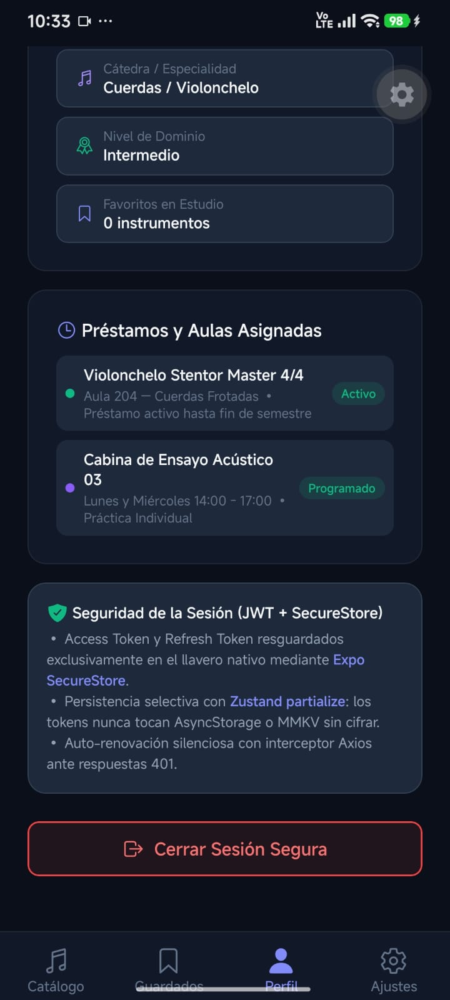

# Proyecto Semana 08 — Autenticación Completa (Escuela de Música)

Proyecto móvil desarrollado en **React Native**, **Expo SDK 57**, **React Navigation 7**, **TypeScript**, **Zustand**, **Expo SecureStore**, **Axios**, **TanStack Query v5**, **React Hook Form** y **Zod**, correspondiente a la **Semana 08 — Autenticación Completa**, enfocado en la implementación de una arquitectura robusta de autenticación basada en **JWT**, navegación condicional y resguardo seguro de tokens para la **Escuela de Música / Conservatorio Académico**.

---

## 🎯 Arquitectura de Autenticación y Navegación Condicional

El sistema de autenticación implementa un ciclo de vida completo de seguridad con separación estricta de responsabilidades:



---

## 🔑 Pilares Técnicos de la Semana 08

### 1. Esquemas de Validación con Zod y React Hook Form (`src/schemas/authSchema.ts`)
- **`loginSchema`**: Validación para nombre de usuario (mínimo 3 caracteres, máx 50) y contraseña segura.
- **`registerSchema`**: Validación para nuevo ingreso de estudiantes con nombre completo, usuario alfanumérico, email institucional válido, contraseña (mínimo 6 caracteres), cátedra/familia instrumental de interés (`CATEGORIES`) y nivel académico inicial (`LEVELS`).
- **Formularios Reactivos:** En `LoginScreen.tsx` y `RegisterScreen.tsx`, integrados con `useForm<T>`, `zodResolver` y el componente reutilizable `FormField.tsx`.
- **Chips de Credenciales de Prueba:** Acceso rápido para pruebas fluidas con DummyJSON (`emilys` / `emilyspass`) o cuentas institucionales de demostración (alumno demo y profesor).

### 2. Almacenamiento Cifrado de Tokens con Expo SecureStore (`src/services/tokenService.ts`)
- **Aislamiento por Hardware:** `accessToken` y `refreshToken` se guardan **exclusivamente** en el Secure Enclave / Keystore del dispositivo a través de `expo-secure-store`.
- **Restricción Estricta:** Los tokens JWT **NUNCA** se almacenan en `AsyncStorage` ni en `MMKV` sin cifrar.
- **Operaciones:** `getAccessToken()`, `setAccessToken()`, `getRefreshToken()`, `setRefreshToken()`, `setTokens()` y `clearTokens()`, con fallback seguro en memoria para navegadores web.

### 3. Store de Autenticación con Persistencia Selectiva (`src/stores/authStore.ts`)
- **Zustand con `persist` y `partialize`:**
  ```typescript
  partialize: (state) => ({
    user: state.user,
    isAuthenticated: state.isAuthenticated,
  })
  ```
  Solo los datos descriptivos del usuario y el flag booleano de sesión se sincronizan en `AsyncStorage`, manteniendo los tokens en `tokenService` (SecureStore).
- **Acciones Fuertemente Tipadas:** `login()`, `register()`, `logout()`, `refreshTokens()`, `checkAuth()` y `clearError()`, con cero uso de `any`.

### 4. Interceptores de Axios y Flujo Auto-Refresh (`src/services/api.ts`)
- **Request Interceptor:** Consulta el `accessToken` en `tokenService` e inyecta de forma transparente la cabecera:
  ```http
  Authorization: Bearer <accessToken>
  ```
- **Response Interceptor:** Ante respuestas HTTP `401 Unauthorized`:
  1. Evita bucles infinitos mediante bandera de reintento (`originalRequest._retry = true`).
  2. Dispara `useAuthStore.getState().refreshTokens()` enviando el `refreshToken` a la API.
  3. Al renovar con éxito, actualiza la cabecera de la petición original y la reintenta automáticamente sin interrumpir la experiencia de usuario.
  4. Si el token de refresco también expiró o es revocado, cierra la sesión de forma segura con `logout()`.

### 5. Navegación Condicional en `RootNavigator.tsx`
- **Cambio Dinámico:**
  - Si `isLoading === true`: Presenta pantalla splash musical de validación de credenciales.
  - Si `!isAuthenticated`: Monta de manera aislada el `AuthNavigator` (`LoginScreen` y `RegisterScreen`).
  - Si `isAuthenticated`: Monta el `AppNavigator` (`HomeTab`, `SavedTab`, `ProfileTab`, `SettingsTab` y stacks asociados).
- **Sin Fuga de Historial:** Al cambiar el estado de autenticación, React Navigation reconstruye el árbol de vistas, impidiendo regresar a pantallas protegidas mediante el botón atrás tras cerrar sesión.

### 6. Pantalla de Perfil de Músico (`src/screens/ProfileScreen.tsx`)
- Muestra los datos del estudiante o docente autenticado: Avatar, Nombre completo, Correo institucional, Rol (`Estudiante`, `Profesor`, `Coordinador`).
- **Datos del Dominio:** Matrícula institucional (`MUS-2026-ACT`), Cátedra musical asignada, Nivel de dominio técnico y contador en vivo de instrumentos en estudio.
- **Reservas Activas:** Lista de instrumentos prestados y cabinas de ensayo acústico programadas.
- **Cerrar Sesión:** Acción con confirmación nativa que purga los tokens del SecureStore y resetea el estado global de Zustand.

---

## 📸 Evidencias de la Aplicación en Expo Go (Android)

### 🔐 1. Flujo de Autenticación, Sesión Segura y Perfil (Semana 08)

Las siguientes capturas documentan las pantallas y el flujo de autenticación JWT implementado en la aplicación:

| 1. Formulario de Login | 2. Verificación SecureStore |
| :---: | :---: |
|  |  |
| *Pantalla de acceso con validación Zod, React Hook Form y chips de prueba rápida* | *Splash de carga reactivo validando tokens en el llavero cifrado de Expo SecureStore* |

<br />

| 3. Perfil del Músico Autenticado | 4. Llavero Seguro y Cierre de Sesión |
| :---: | :---: |
|  |  |
| *Perfil del estudiante con matrícula oficial, cátedra instrumental y préstamos activos* | *Tarjeta técnica de seguridad JWT + SecureStore y botón para cerrar sesión* |

<br />

### 📦 2. Catálogo, Persistencia Local y Caché Offline (Semanas Anteriores)

| 5. Catálogo y Navegación | 6. Botón Guardar en Tarjetas | 7. Búsqueda y Filtrado en Vivo |
| :---: | :---: | :---: |
|  |  |  |
| *HomeScreen con pestañas de navegación ("Catálogo" y "Guardados")* | *Tarjeta de instrumento con botón interactivo "Guardar" conectado al store* | *Filtrado en tiempo real con término de búsqueda "Viol" y contador dinámico* |

<br />

| 8. Manejo de Error de Red (Network Error) | 9. Guardados con Badge en Tiempo Real | 10. Edición PUT/PATCH con Hook Form + Zod |
| :---: | :---: | :---: |
|  |  |  |
| *Estado de error con botón "Reintentar Conexión" al fallar la petición HTTP* | *Tab de Guardados con botón "Limpiar" y badge numérico "1" sincronizado en vivo con Zustand* | *Pantalla EditScreen con datos precargados vía reset(), chips de categoría/nivel y validación Zod* |

<br />

| 11. Preferencias Síncronas (MMKV) | 12. Llavero Seguro (SecureStore) y Caché Offline |
| :---: | :---: |
|  |  |
| *Pantalla de Ajustes con selectores y switches reactivos síncronos (orden, modo compacto, ítems por lote)* | *Gestión de clave de administración cifrada en hardware (SecureStore) y estado de la caché offline en AsyncStorage (12 instrumentos)* |

---

## 🔒 Tipado Estricto de Autenticación con Zod e Inferencia TypeScript

```typescript
// src/schemas/authSchema.ts
import { z } from 'zod';
import { CATEGORIES, LEVELS } from './itemSchema';

export const loginSchema = z.object({
  username: z
    .string()
    .min(3, 'El nombre de usuario debe contener al menos 3 caracteres')
    .max(50, 'El nombre de usuario no puede exceder 50 caracteres'),
  password: z
    .string()
    .min(4, 'La contraseña debe contener al menos 4 caracteres'),
});

export type LoginFormData = z.infer<typeof loginSchema>;

export const registerSchema = z.object({
  fullName: z
    .string()
    .min(3, 'El nombre completo debe contener al menos 3 caracteres')
    .max(80, 'El nombre no puede exceder 80 caracteres'),
  username: z
    .string()
    .min(3, 'El nombre de usuario debe contener al menos 3 caracteres')
    .max(30, 'El nombre de usuario no puede superar 30 caracteres')
    .regex(/^[a-zA-Z0-9_]+$/, 'Solo se permiten letras, números y guiones bajos'),
  email: z
    .string()
    .email('Debe ingresar un correo electrónico institucional o personal válido'),
  password: z
    .string()
    .min(6, 'La contraseña debe tener al menos 6 caracteres'),
  instrumentInterest: z.enum(CATEGORIES),
  academicLevel: z.enum(LEVELS),
});

export type RegisterFormData = z.infer<typeof registerSchema>;
```

---

## 📂 Estructura del Proyecto

```text
├── images/                          # Evidencias fotográficas en Expo Go
├── src/
│   ├── components/
│   │   ├── FormField.tsx            # Componente reutilizable con Controller, TextInput y errores
│   │   └── ItemCard.tsx             # Tarjeta interactiva con soporte para compactMode (MMKV)
│   ├── data/
│   │   └── mockData.ts              # Catálogo base de instrumentos, profesores y alumnos
│   ├── hooks/
│   │   ├── useItems.ts              # TanStack Query + caché offline con AsyncStorage
│   │   ├── usePreferences.ts        # Hook reactivo síncrono con MMKV (sortOrder, compactMode)
│   │   └── useCreateItem.ts         # Hook de mutación con invalidación de caché
│   ├── navigation/
│   │   ├── RootNavigator.tsx        # Navegación condicional (AuthNavigator vs AppNavigator)
│   │   ├── AuthNavigator.tsx        # Stack no autenticado (Login y Registro)
│   │   ├── AppNavigator.tsx         # Stack autenticado (HomeTab, SavedTab, ProfileTab, SettingsTab)
│   │   └── types.ts                 # Tipos fuertemente tipados de navegación (cero any)
│   ├── schemas/
│   │   ├── authSchema.ts            # Esquemas Zod para login y registro (LoginFormData, RegisterFormData)
│   │   └── itemSchema.ts            # Esquema Zod para instrumentos (ItemFormData)
│   ├── screens/
│   │   ├── LoginScreen.tsx          # Formulario de acceso con Zod + Hook Form y chips de prueba
│   │   ├── RegisterScreen.tsx       # Formulario de registro con selectores de cátedra y nivel
│   │   ├── HomeScreen.tsx           # Catálogo con saludo institucional al músico y acceso a perfil
│   │   ├── ProfileScreen.tsx        # Perfil del usuario, matrícula, reservas activas y logout
│   │   ├── DetailScreen.tsx         # Ficha técnica de instrumentos
│   │   ├── CreateScreen.tsx         # Formulario de alta de instrumentos (POST)
│   │   ├── EditScreen.tsx           # Formulario de edición de instrumentos (PUT/PATCH)
│   │   ├── SavedScreen.tsx          # Tab de favoritos sincronizado con Zustand
│   │   └── SettingsScreen.tsx       # Panel de preferencias MMKV, SecureStore y AsyncStorage
│   ├── services/
│   │   ├── api.ts                   # Instancia Axios con interceptores Bearer y auto-refresh 401
│   │   ├── authService.ts           # Servicios de API auth (loginApi, refreshTokensApi, getMeApi, registerApi)
│   │   └── tokenService.ts          # Wrapper de Expo SecureStore para tokens JWT seguros
│   ├── storage/
│   │   ├── mmkv.ts                  # Instancia global de MMKV con fallback síncrono
│   │   └── secureStore.ts           # Wrapper seguro de Expo SecureStore con enmascaramiento
│   ├── stores/
│   │   ├── authStore.ts             # Store global de autenticación con Zustand (persist + partialize)
│   │   └── savedStore.ts            # Store global de instrumentos guardados
│   ├── theme/
│   │   └── index.ts                 # Design System (COLORS, SPACING, TYPOGRAPHY, RADIUS, SIZES)
│   └── types/
│       └── index.ts                 # Tipos de dominio: Instrument, User, AuthTokens, LoginResponse, etc.
├── .npmrc                           # Configuración pnpm (node-linker=hoisted)
├── app.json                         # Configuración de Expo (plugin expo-secure-store)
├── App.tsx                          # QueryClientProvider + SafeAreaProvider + RootNavigator
├── index.ts                         # Entrypoint de Expo
├── package.json                     # Dependencias (Expo SDK 57, React Hook Form, Zod, Zustand, Axios)
├── README.md                        # Documentación técnica
└── tsconfig.json                    # Configuración estricta de TypeScript
```

---

## ⚙️ Cómo Ejecutar el Proyecto con pnpm

1. **Instalar dependencias:**
   ```bash
   pnpm install
   ```

2. **Iniciar el servidor de desarrollo de Expo para móvil (Expo Go):**
   ```bash
   pnpm start
   ```

3. **Iniciar en web:**
   ```bash
   pnpm web
   ```

4. **Validación estricta de TypeScript (0 errores, 0 `any`):**
   ```bash
   pnpm exec tsc --noEmit
   ```
