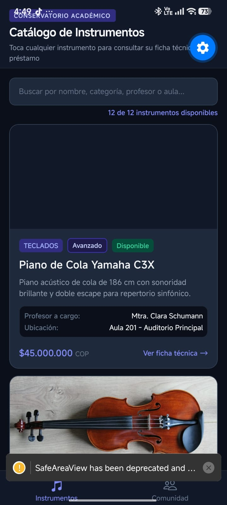
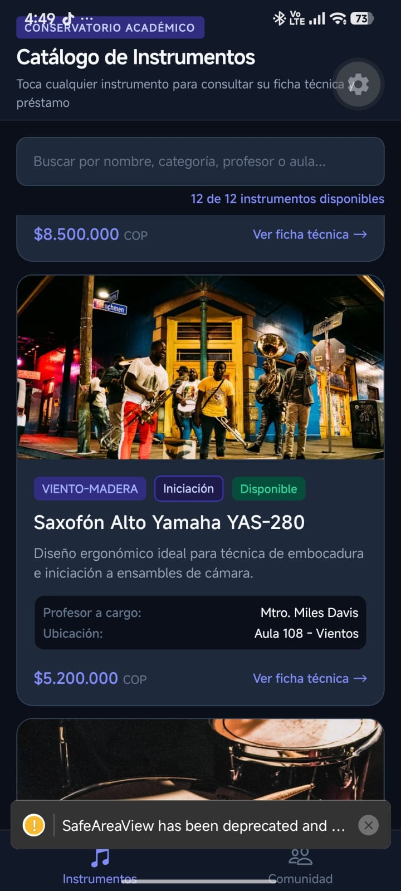
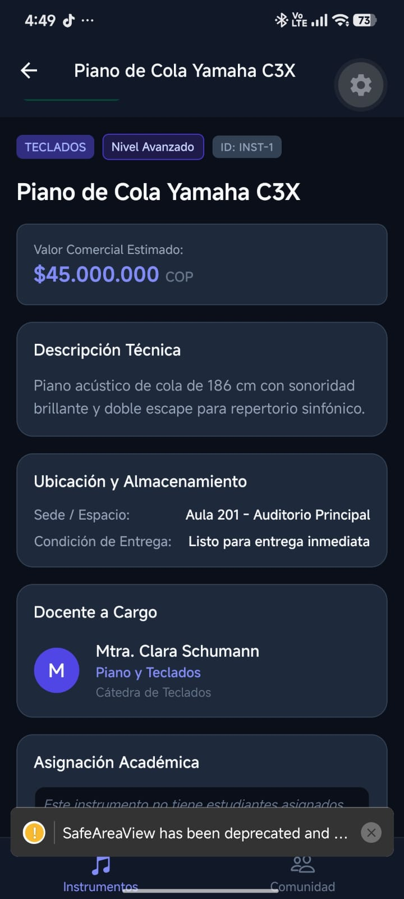
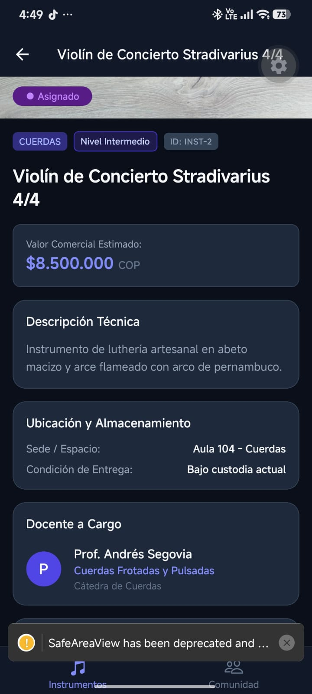
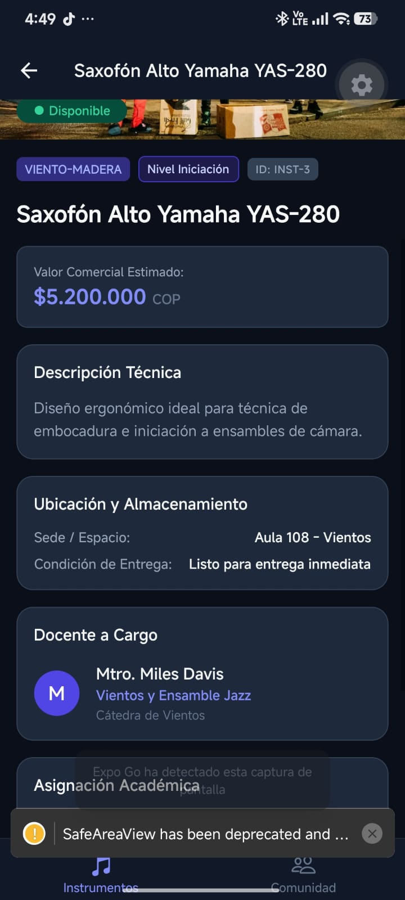
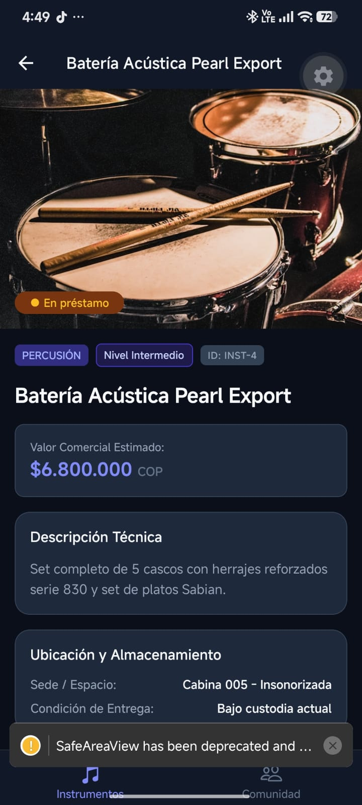
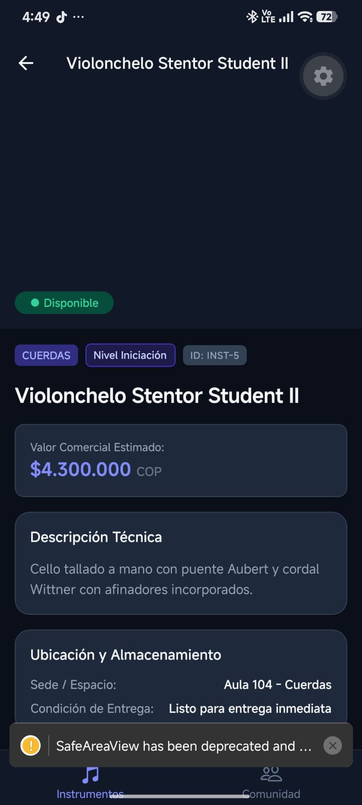

# Proyecto Semana 03 — React Navigation 7 (Escuela de Música)

Proyecto móvil desarrollado en **React Native**, **Expo SDK 57** y **TypeScript**, correspondiente a la **Semana 03 — React Navigation 7**, enfocado en el dominio de gestión y catálogo pedagógico de la **Escuela de Música / Conservatorio Académico**.

---

## 🎯 Arquitectura de Navegación (React Navigation 7)

La aplicación implementa una arquitectura híbrida compuesta por un **Bottom Tab Navigator** con un **Native Stack Navigator anidado**, 100% tipada sin uso de `any` y soportada por `react-native-safe-area-context` y `react-native-screens`.

```mermaid
graph TD
    App[App.tsx - SafeAreaProvider] --> NavContainer[NavigationContainer - DarkTheme]
    NavContainer --> TabNav[Bottom Tab Navigator]
    
    TabNav -->|Tab 1: musical-notes| StackNav[CatalogStackNavigator]
    TabNav -->|Tab 2: people| CommunityScreen[CommunityScreen]
    
    StackNav -->|Ruta Inicial| HomeScreen[HomeScreen - Catálogo con Buscador]
    StackNav -->|navigation.navigate 'Detail', { instrument }| DetailScreen[DetailScreen - Ficha Técnica]
```

### 1. Tab 1: "Instrumentos" (Stack Navigator Anidado)
- **`HomeScreen`**: Lista de instrumentos con buscador en tiempo real, optimizada con `FlatList`, `useMemo` y `useCallback`. Cada tarjeta (`ItemCard`) es interactiva y dispara la navegación tipada hacia el detalle.
- **`DetailScreen`**: Pantalla a la que se navega al tocar cualquier instrumento del catálogo. Extrae los parámetros fuertemente tipados mediante `useRoute<DetailScreenRouteProp>()` mostrando:
  - Imagen hero de alta resolución con badge de disponibilidad.
  - Especificaciones técnicas completas y valor comercial en COP.
  - Ubicación física en aulas y talleres del campus.
  - Tarjeta del docente responsable de la cátedra.
  - Estado de asignación del estudiante actual (o indicación de disponibilidad).
  - Botón de acción para solicitud de reserva/préstamo y retroceso hacia el catálogo.

### 2. Tab 2: "Comunidad" (Directorio Académico)
- **`CommunityScreen`**: Directorio interactivo de la comunidad del conservatorio con selector por pestañas:
  - **Docentes (`TEACHERS`)**: Lista a los maestros, especialidad, cátedra asignada y conteo de instrumentos bajo custodia.
  - **Estudiantes (`STUDENTS`)**: Lista a los alumnos matriculados, nivel técnico e instrumento que tienen en préstamo activo.

### 3. Iconografía y Temas
- Iconos dinámicos en los tabs con `@expo/vector-icons` (`Ionicons`):
  - Catálogo: `musical-notes` / `musical-notes-outline`
  - Comunidad: `people` / `people-outline`
- Tema oscuro centralizado (`src/theme/index.ts`) integrado en el `NavigationContainer`, headers y tab bar.

---

## 📸 Evidencias de Navegación en Expo Go (Android)

Las siguientes capturas documentan la aplicación de la **Semana 03** corriendo en un dispositivo móvil real a través de **Expo Go**, demostrando el funcionamiento del **Bottom Tab Navigator** y la transición al **DetailScreen mediante Stack Navigator anidado**:

| 1. Catálogo Principal (Tab 1) | 2. Tarjeta con Acción a Detalle | 3. Ficha Técnica: Piano de Cola |
| :---: | :---: | :---: |
|  |  |  |
| *HomeScreen con Bottom Tabs, buscador y botón "Ver ficha técnica →"* | *Tarjeta de Saxofón Yamaha con badges y acción onPress* | *DetailScreen de Piano C3X con useRoute, precio y cátedra* |

<br />

| 4. Detalle: Violín Stradivarius | 5. Detalle: Saxofón Alto | 6. Detalle: Batería Pearl |
| :---: | :---: | :---: |
|  |  |  |
| *Ficha técnica con estado "Asignado" y Prof. Andrés Segovia* | *Ficha técnica con estado "Disponible" y Mtro. Miles Davis* | *Ficha técnica con estado "En préstamo" y Cabina Insonorizada* |

<br />

| 7. Detalle: Violonchelo Stentor Student |
| :---: |
|  |
| *Ficha técnica con descripción de luthería, ubicación y tabs inferiores* |

---

## 🔒 Tipado Estricto de Navegación (`src/navigation/types.ts`)

Cumpliendo con los estándares de TypeScript y React Navigation 7, no se utiliza `any`:

```typescript
export type RootStackParamList = {
  Home: undefined;
  Detail: {
    instrument: Instrument;
  };
};

export type RootTabParamList = {
  CatalogTab: undefined;
  CommunityTab: undefined;
};

// Composite Props para navegación cruzada segura
export type HomeScreenProps = CompositeScreenProps<
  NativeStackScreenProps<RootStackParamList, 'Home'>,
  BottomTabScreenProps<RootTabParamList>
>;

export type DetailScreenRouteProp = RouteProp<RootStackParamList, 'Detail'>;
export type DetailScreenNavigationProp = NativeStackNavigationProp<RootStackParamList, 'Detail'>;
```

---

## 📂 Estructura del Proyecto

```text
├── images/                       # Evidencias fotográficas en Expo Go
├── src/
│   ├── components/
│   │   └── ItemCard.tsx          # Tarjeta interactiva con onPress y visualización de precio
│   ├── data/
│   │   └── mockData.ts           # 12 instrumentos, 4 profesores y 3 estudiantes tipados
│   ├── navigation/
│   │   ├── AppNavigator.tsx      # NavigationContainer, BottomTabNavigator y Stack anidado
│   │   └── types.ts              # RootStackParamList, RootTabParamList y ScreenProps
│   ├── screens/
│   │   ├── HomeScreen.tsx        # Catálogo FlatList con buscador en tiempo real
│   │   ├── DetailScreen.tsx      # Ficha técnica que consume useRoute<DetailScreenRouteProp>()
│   │   └── CommunityScreen.tsx   # Tab de Comunidad con conmutador Profesores / Estudiantes
│   ├── theme/
│   │   └── index.ts              # Constantes de diseño (COLORS, SPACING, TYPOGRAPHY, RADIUS, SIZES)
│   └── types/
│       └── index.ts              # Modelos de datos (Instrument, Teacher, Student)
├── .npmrc                        # Configuración pnpm (node-linker=hoisted)
├── app.json                      # Configuración de Expo
├── App.tsx                       # Renderiza SafeAreaProvider y AppNavigator
├── index.ts                      # Entrypoint de Expo
├── package.json                  # Dependencias del proyecto (Expo SDK 57, React Navigation 7)
├── README.md                     # Documentación técnica
└── tsconfig.json                 # Configuración estricta de TypeScript
```

---

## ⚙️ Cómo Ejecutar el Proyecto con pnpm

1. **Instalar dependencias:**
   ```bash
   pnpm install
   ```

2. **Iniciar el servidor de desarrollo de Expo para móvil (Expo Go):**
   ```bash
   pnpm start
   ```

3. **Iniciar en web:**
   ```bash
   pnpm web
   ```

4. **Validación estricta de TypeScript:**
   ```bash
   pnpm exec tsc --noEmit
   ```
