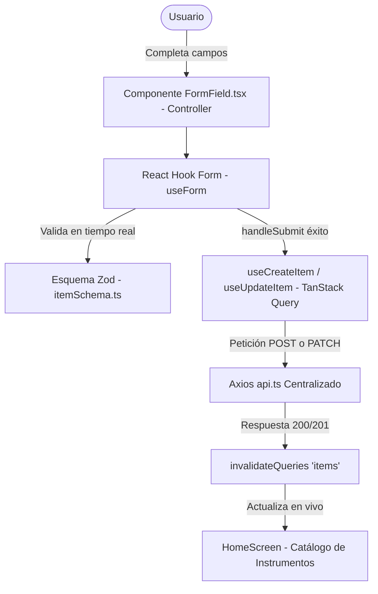

# Proyecto Semana 06 — Formularios con React Hook Form + Zod (Escuela de Música)

Proyecto móvil desarrollado en **React Native**, **Expo SDK 57**, **React Navigation 7**, **TypeScript**, **Axios**, **TanStack Query v5**, **React Hook Form** y **Zod**, correspondiente a la **Semana 06 — Formularios con React Hook Form + Zod**, enfocado en la validación estricta y gestión de formularios de alta (`CreateScreen`) y edición (`EditScreen`) para la **Escuela de Música / Conservatorio Académico**.

---

## 🎯 Arquitectura de Formularios y Validación

La aplicación incorpora un flujo completo de gestión de datos mediante formularios declarativos con **React Hook Form**, validados mediante esquemas tipados con **Zod**, e integrados con mutaciones de red en **TanStack Query v5** y **Axios**:



### 1. Esquema de Validación con Zod (`src/schemas/itemSchema.ts`)
- Esquema estricto `itemSchema` con reglas del dominio:
  - **Nombre:** Obligatorio, entre 3 y 80 caracteres.
  - **Categoría y Nivel:** Enums validados contra listas de cátedras reales (`Cuerdas`, `Viento-Madera`, etc.).
  - **Precio Comercial (`priceCOP`):** Coerción numérica positiva con validación de valor mínimo ($50.000 COP).
  - **Ubicación y Descripción:** Longitud mínima obligatoria para descripciones técnicas de luthería.
- Inferencia de tipos estricta sin `any`: `export type ItemFormData = z.infer<typeof itemSchema>;`.

### 2. Componente Reutilizable `FormField.tsx` (`src/components/FormField.tsx`)
- Encapsula `Controller` de React Hook Form, el componente nativo `TextInput` y el renderizado condicional de mensajes de error de validación.
- Soporta entradas de texto, multilínea y filtrado numérico para valores monetarios.
- Reutilizado de forma uniforme en `CreateScreen` y `EditScreen`, eliminando duplicación de código.

### 3. Formulario de Creación (`CreateScreen.tsx`)
- Gestionado con `useForm<ItemFormData>({ resolver: zodResolver(itemSchema) })`.
- Conectado a la mutación `useCreateItem()`.
- Deshabilita el botón y muestra `ActivityIndicator` mientras se procesa el registro.
- Redirección automática hacia el catálogo (`goBack`) tras el registro exitoso.

### 4. Formulario de Edición (`EditScreen.tsx`)
- Recibe el `id` del instrumento mediante parámetros de navegación.
- Obtiene los datos actualizados mediante `useItemById(id)`.
- Utiliza el método `reset()` de React Hook Form dentro de un `useEffect` para precargar y sincronizar los `defaultValues`.
- Conectado a la mutación `useUpdateItem()` para enviar actualizaciones mediante `PATCH/PUT` con Axios y sincronizar la caché.

---

## 📸 Evidencias de la Aplicación en Expo Go (Android)

Las siguientes capturas documentan la aplicación corriendo en un dispositivo móvil real a través de **Expo Go**:

| 1. Catálogo y Navegación | 2. Botón Guardar en Tarjetas | 3. Búsqueda y Filtrado en Vivo |
| :---: | :---: | :---: |
|  |  |  |
| *HomeScreen con pestañas de navegación ("Catálogo" y "Guardados")* | *Tarjeta de instrumento con botón interactivo "Guardar" conectado al store* | *Filtrado en tiempo real con término de búsqueda "Viol" y contador dinámico* |

<br />

| 4. Manejo de Error de Red (Network Error) | 5. Guardados con Badge en Tiempo Real | 6. Edición PUT/PATCH con Hook Form + Zod |
| :---: | :---: | :---: |
|  |  |  |
| *Estado de error con botón "Reintentar Conexión" al fallar la petición HTTP* | *Tab de Guardados con botón "Limpiar" y badge numérico "1" sincronizado en vivo con Zustand* | *Pantalla EditScreen con datos precargados vía reset(), chips de categoría/nivel y validación Zod* |

---

## 🔒 Tipado Estricto con Zod e Inferencia TypeScript

```typescript
// src/schemas/itemSchema.ts
export const itemSchema = z.object({
  name: z.string().min(3, 'El nombre debe contener al menos 3 caracteres'),
  category: z.enum(CATEGORIES),
  level: z.enum(LEVELS),
  priceCOP: z
    .number()
    .positive('El valor comercial debe ser mayor a 0 COP')
    .min(50000, 'El valor mínimo registrado es $50.000 COP'),
  roomLocation: z.string().min(3, 'Ubicación en campus obligatoria'),
  description: z.string().min(10, 'Descripción técnica obligatoria (mínimo 10 caracteres)'),
  imageUrl: z.string().url().optional().or(z.literal('')),
});

export type ItemFormData = z.infer<typeof itemSchema>;
```

---

## 📂 Estructura del Proyecto

```text
├── images/                          # Evidencias fotográficas en Expo Go
├── src/
│   ├── components/
│   │   ├── FormField.tsx            # Componente reutilizable con Controller, TextInput y errores
│   │   └── ItemCard.tsx             # Tarjeta interactiva con botones de navegación, guardado y edición
│   ├── data/
│   │   └── mockData.ts              # Catálogo base de instrumentos, profesores y alumnos
│   ├── hooks/
│   │   ├── useItems.ts              # useItems, useItemById, useCreateItem, useUpdateItem
│   │   └── useCreateItem.ts         # Hook compatible de mutación con invalidación de caché
│   ├── navigation/
│   │   ├── RootNavigator.tsx        # Stack Navigator anidado (Home, Detail, Create, Edit) + Tabs
│   │   ├── AppNavigator.tsx         # Exportador compatible de RootNavigator
│   │   └── types.ts                 # HomeStackParamList (Home, Detail, Create, Edit) y RootTabParamList
│   ├── schemas/
│   │   └── itemSchema.ts            # Esquema Zod + inferencia ItemFormData
│   ├── screens/
│   │   ├── HomeScreen.tsx           # Catálogo con useItems, pull-to-refresh y acceso a Create / Edit
│   │   ├── DetailScreen.tsx         # Ficha técnica con acceso directo a edición
│   │   ├── CreateScreen.tsx         # Formulario de alta con React Hook Form + Zod
│   │   ├── EditScreen.tsx           # Formulario de edición con defaultValues y reset()
│   │   └── SavedScreen.tsx          # Tab de favoritos sincronizado con Zustand
│   ├── services/
│   │   └── api.ts                   # Instancia centralizada de Axios con endpoints GET, POST y PATCH
│   ├── stores/
│   │   └── savedStore.ts            # Store global de Zustand
│   ├── theme/
│   │   └── index.ts                 # Constantes de diseño (COLORS, SPACING, TYPOGRAPHY, RADIUS, SIZES)
│   └── types/
│       └── index.ts                 # Interfaces: Instrument, Item, CreateItemPayload, UpdateItemPayload
├── .npmrc                           # Configuración pnpm (node-linker=hoisted)
├── app.json                         # Configuración de Expo
├── App.tsx                          # QueryClientProvider + SafeAreaProvider + RootNavigator
├── index.ts                         # Entrypoint de Expo
├── package.json                     # Dependencias (Expo SDK 57, React Hook Form, Zod, TanStack Query)
├── README.md                        # Documentación técnica
└── tsconfig.json                    # Configuración estricta de TypeScript
```

---

## ⚙️ Cómo Ejecutar el Proyecto con pnpm

1. **Instalar dependencias:**
   ```bash
   pnpm install
   ```

2. **Iniciar el servidor de desarrollo de Expo para móvil (Expo Go):**
   ```bash
   pnpm start
   ```

3. **Iniciar en web:**
   ```bash
   pnpm web
   ```

4. **Validación estricta de TypeScript:**
   ```bash
   pnpm exec tsc --noEmit
   ```
